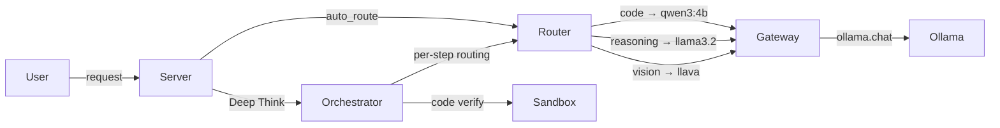

# ARIA Multi-Model Architecture — Walkthrough

## Summary

Completed the server integration for ARIA's multi-model architecture. All direct `ollama.chat()` calls in `server.py` have been replaced with the new Gateway + Router pipeline. The system now **automatically routes** each request to the best model based on task type.

## Architecture



## Changes Made

### [server.py](file:///d:/Soverign%20Local%20AI/ollama/server.py) — Full rewrite

| Change | Details |
|--------|---------|
| **Imports & init** | Gateway, Router, Orchestrator, Sandbox initialized at startup with status logging |
| **`/api/chat`** | Routes through Gateway + Router. Supports `auto_route` (default: true). Returns `routing` info in response |
| **`/api/tool`** | Calls through Gateway with auto-routing |
| **`/api/doc-query`** | Calls through Gateway with auto-routing |
| **`/api/orchestrate`** | **NEW** — Deep Think mode: plan→execute→verify→synthesize |
| **`/api/routing-info`** | **NEW** — Returns routing table, recent decisions, gateway stats. POST to preview routing |
| **`/api/models`** | Now returns `routing_table` alongside model list with `tasks` field |
| **Health endpoints** | Report architecture status and gateway stats |
| **`warm_up()`** | Delegates to `gateway.warm_up()` |
| **`AVAILABLE_MODELS`** | Updated with `tasks` field and added `qwen3:4b` + `llava` |

---

### [gateway.py](file:///d:/Soverign%20Local%20AI/ollama/gateway.py) — Bug fix

- Replaced Unicode `→` and `—` with ASCII `->` and `--` to fix `UnicodeEncodeError` on Windows cp1252 terminals

### [router.py](file:///d:/Soverign%20Local%20AI/ollama/router.py) — Bug fix

- Same Unicode fix as gateway.py

## Test Results

All tests passed:

| Test | Status | Key Assertion |
|------|--------|---------------|
| Router classification | ✅ | `"write a python function"` → qwen3:4b (code) |
| Router classification | ✅ | `"explain quantum physics"` → llama3.2 (reasoning) |
| Router classification | ✅ | `"hello how are you"` → llama3.2 (general) |
| Sandbox execution | ✅ | `print(2+2)` → output "4", success=True |
| Sandbox timeout | ✅ | `time.sleep(10)` → timed_out=True after 5s |
| Gateway connectivity | ✅ | Ollama reachable, 2 models pulled |
| E2E: Health check | ✅ | Architecture info in response |
| E2E: Models endpoint | ✅ | 4 models + routing table |
| E2E: Chat (code) | ✅ | Routed to qwen3:4b, got fibonacci code |
| E2E: Chat (reasoning) | ✅ | Routed to llama3.2, got sky explanation |
| E2E: Routing info | ✅ | Preview + stats returned |
| E2E: Tool endpoint | ✅ | Gateway routing active |

## How to Use

```bash
# Start the server
python server.py

# Open the frontend
# Open index.html in Chrome/Edge

# The Router auto-selects models:
# - Code questions → qwen3:4b
# - Reasoning → llama3.2
# - General → llama3.2
# - Images → llava

# Toggle "Deep Think" (🧠 button) for multi-step orchestration
```
